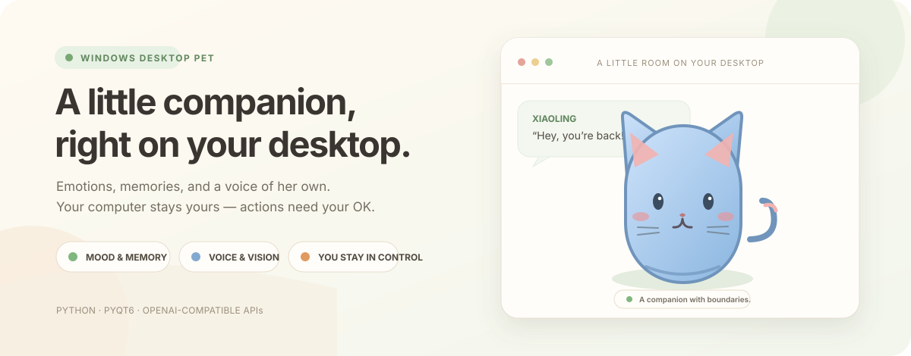

<div align="center">
  
  <p><a href="README.md">简体中文</a> · <a href="README_EN.md">English</a></p>
  <p>
    <a href="https://github.com/liuxinhaoboy/DesktopCompanion/actions/workflows/tests.yml"></a>
    <a href="https://github.com/liuxinhaoboy/DesktopCompanion/stargazers"></a>
    
    
  </p>
</div>

# DesktopCompanion

A small AI companion that lives on your Windows desktop. It breathes, blinks, remembers conversations, and changes its mood as you interact. Optional voice and image chat are available, and computer or browser actions always require your confirmation.

## Highlights

- **A companion, not just an avatar:** affinity, mood, trust, hunger, sleep, and character-specific memories persist between sessions.
- **Make it yours:** switch between built-in characters, import a character pack, use a PNG portrait, or upload a GLB/GLTF model.
- **Talk naturally:** streaming chat through an OpenAI-compatible API; optional speech-to-text, text-to-speech, and image input.
- **Consent-first controls:** file operations stay inside a workspace, destructive actions are reversible where possible, and every computer/browser action is reviewed before execution.
- **Privacy-aware by default:** API keys are protected with Windows DPAPI when available; audio is not retained by default; chat history and memories are stored locally.

## Quick start

**Requirements:** Windows 10/11, Python 3.11 or later, and an OpenAI-compatible API endpoint for AI chat. API usage may incur provider charges.

1. Download or clone this repository.
2. Open PowerShell in the project folder and install dependencies:

   ```powershell
   py -m pip install -r requirements.txt
   ```

   If the Python launcher is unavailable, use `python -m pip install -r requirements.txt` instead. Use the same Python installation for setup and launch.

3. Double-click `run.bat`. On first launch, the app creates a local `config.json` from `config_template.json`; no manual file copy is needed.
4. Right-click the pet → **Settings** → **AI & Multimodal**. Enter your provider's Base URL, API key, and model, then use **Test connection**.

The app currently runs from source; a packaged installer is not provided yet. For screenshots and the full Chinese setup guide, see the [Chinese README](README.md).

## Safety and privacy

- Each computer or browser action shows a confirmation card first. File access is restricted to the configured workspace; process controls are off by default.
- The browser extension talks only to a loopback service on `127.0.0.1` and has a second safety check in the page.
- Persistent history and character memories are stored in the local `data/` folder. Local storage does **not** mean the app stays offline: chat context goes to your configured AI provider; selected images go to the vision model; recordings go to the STT provider; text is sent to the chosen TTS service; and a web page is shared with the AI only after you confirm reading it.
- On Windows, keys are normally encrypted with DPAPI and stored under `data/`. If encryption is unavailable, the app falls back to a plaintext config for compatibility. **Never share `config.json`, `data/`, API keys, logs, or private chat content.** `config.json` is ignored by Git.

## Contributing and feedback

Bug reports, ideas, and questions are welcome in [GitHub Issues](https://github.com/liuxinhaoboy/DesktopCompanion/issues). Include your Windows/Python version and concise reproduction steps; redact personal paths and logs. Do not attach `config.json`, `data/`, screenshots containing private information, or API credentials.

If you enjoy the project, a ⭐ helps other desktop-pet fans discover it.

> **License note:** this repository does not currently include a license. Please contact the maintainer before redistributing or using the code beyond what applicable law permits.
